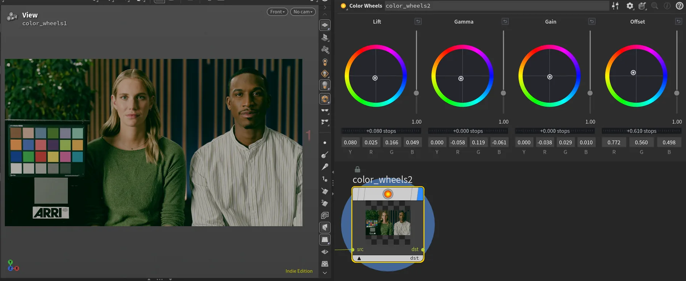

# Color Wheels for Houdini



A Copernicus HDA providing interactive Lift, Gamma, Gain, and Offset color
wheels in Houdini's Parameter Editor. Corrections are expressed in stops and
processed on the GPU in scene-linear light.

## Requirements

- Houdini Indie 22.0 or newer
- A GPU/OpenCL device supported by Houdini

The custom Parameter Editor interface uses Houdini 22's Python Panel support.
The asset is distributed as a Limited Commercial `.hdalc` library.

## Installation

Copy both directories from this repository into your Houdini preferences
directory (for example, `Documents/houdini22.0`):

```text
packages/
ColorWheels/
```

The resulting layout should be:

```text
houdini22.0/
├── packages/
│   └── color_wheels.json
└── ColorWheels/
    ├── otls/
    │   └── cop_Scy.color_wheels.1.0.hdalc
    └── python_panels/
        └── scy_color_wheels.pypanel
```

Restart Houdini. The asset appears in Copernicus under
`ScyTools/COPs/Utilities/` as **Color Wheels**.

## Controls

- **Lift** targets shadows and tapers toward highlights.
- **Gamma** targets midtones while substantially anchoring black and white.
- **Gain** targets highlights.
- **Offset** applies a global exposure-like correction.
- Each wheel has an independent range, reset, and editable channel values.

All neutral controls produce an exact passthrough and alpha is left unchanged.

See [Getting Started](docs/getting-started.md) for a short usage tutorial.

Built by Codex using GPT-5.6-sol (light) and [limitsurface/houdini-cli](https://github.com/limitsurface/houdini-cli).
